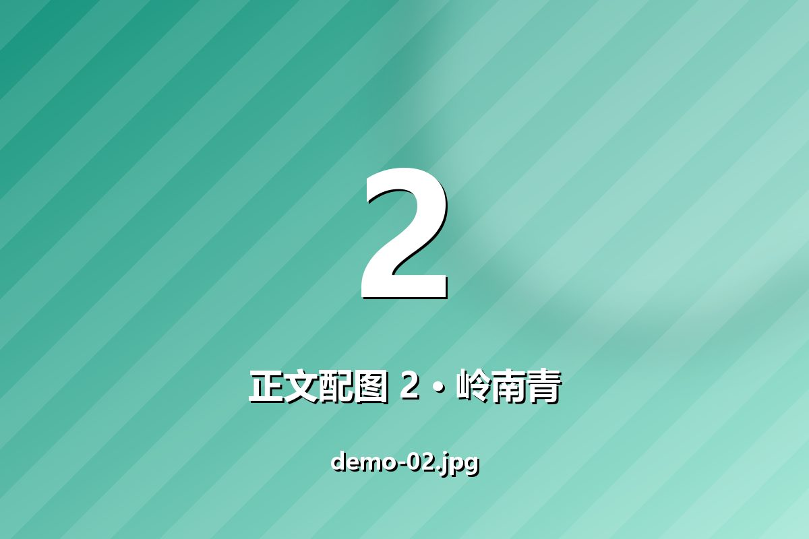
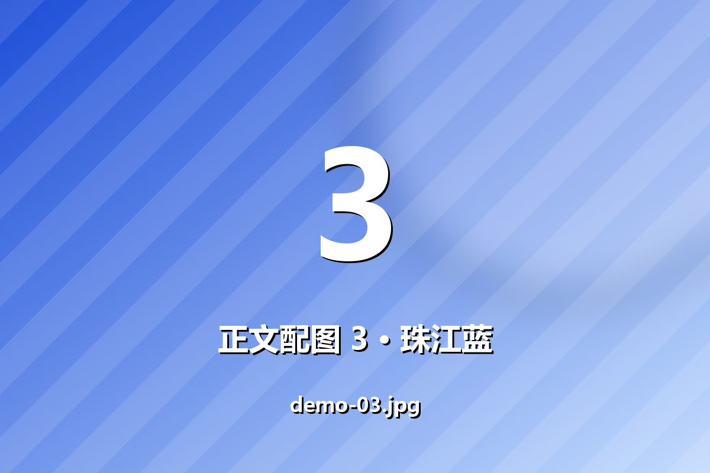

> **这是一篇测试文章。**
> 它唯一的作用是把新增的图片能力摊开给你看：正文配图怎么排、
> 列表页那张卡片怎么用 `cover` 当背景、没有封面时又变成什么样。
> 确认没问题之后，把下面三样一起删掉即可：
>
> - `content/posts/image-cover-demo.mdx`（本篇）
> - `content/posts/image-thumbnails-demo.mdx`（对照文章）
> - `public/images/*_image/` 与 `scripts/make-demo-images.py`

## 先在列表页看那张卡片

回到[首页](/)或[全部文章](/posts)，本篇的卡片现在应该长这样：

| 元素 | 表现 |
| --- | --- |
| 整张卡片 | 以 `demo-cover.jpg` 为**背景**，铺满并居中裁切 |
| 背景之上 | 压一层从下往上的深色渐变，保证标题可读 |
| 标题与摘要 | 白色字，压在下半部分 |
| 缩略图带 | **不显示** —— 有封面时它会让位，避免两种图片语言打架 |

上面那张背景图里我特意把「封面图」几个字放在中上部：卡片压暗的是下半部分，
所以你会看到文字上方清楚、下方被渐变盖住 —— 这正说明背景图是真的铺在卡片上的，
而不是被当成一张普通插图塞在角落里。

## 再看文章页

`cover` 在文章页还有第二个落点：标题下方那张完整的大图。
它的原始尺寸是 1600×900，宽高比 16:9。

## 正文配图

下面是五张编号配图，用的是 Markdown 的图片语法：

```md

```







每张图上都有编号、色名和文件名 —— 这样在列表页瞄一眼缩略图，
就能对上「第几张、哪一张」，不用猜。

## 两种写法都认

卡片上的缩略图是从正文里自动抠出来的，Markdown 和原生标签两种写法都支持：

```mdx
      ← Markdown 语法
   ← 原生标签
```

被刻意**跳过**的有三类：

| 写法 | 为什么跳过 |
| --- | --- |
| 代码块与行内代码里的图片 | 贴一段示例代码不该让卡片多出几张缩略图 |
| `data:` 开头的内联图片 | 会让卡片背上几百 KB 的 base64 |
| 相对路径（`./x.jpg`） | 列表页和文章页的 URL 层级不同，会解析到错误的位置 |

拿本篇来说：正文里一共 6 处图片引用，其中一处写在代码块里会被跳过，
剩下 5 张再去重、按上限截成 4 张。

不过 **本篇有 `cover`，所以卡片上根本不会出现缩略图带** ——
那 4 张只是躺在 `PostMeta.images` 里。想让它们真的出现，见对照文章
[对照文章：不写 cover 时，卡片展示正文缩略图](/posts/image-thumbnails-demo)。

## 相关字段与文件

| 位置 | 管什么 |
| --- | --- |
| frontmatter 的 `cover` | 卡片背景图 + 文章页顶部大图 |
| 正文里的图片 | 卡片的缩略图带（最多 4 张） |
| `src/lib/posts.ts` 的 `extractImages()` | 怎么从 MDX 里把图片抠出来 |
| `src/components/PostCard.tsx` | 卡片上两种图片语言的排版 |
| `scripts/make-demo-images.py` | 这些示例配图是怎么生成的 |
