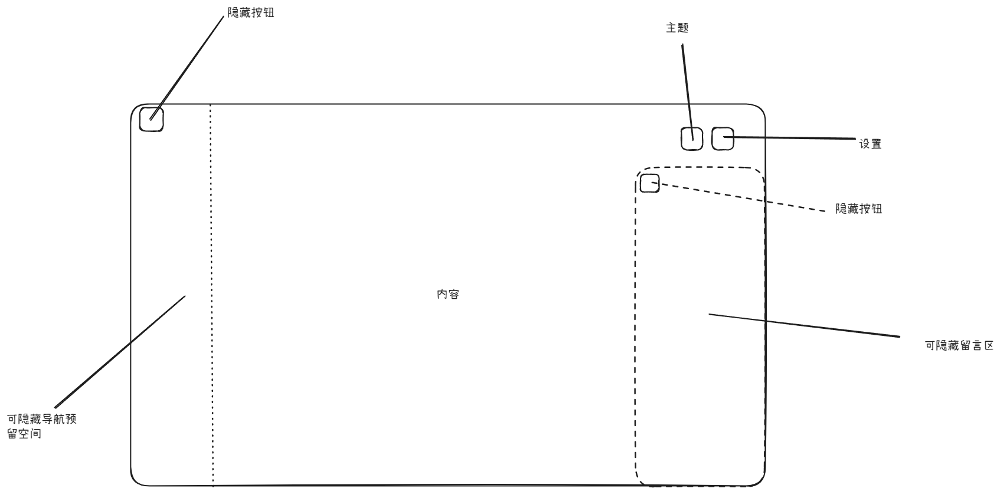

# 花城博客 · 设计文档

> **这份文档回答「为什么这样建」。**
> 怎么跑起来、怎么写文章、怎么部署，见 [README.md](README.md)。
> 两者刻意分开：README 会随着操作步骤变，设计文档只在架构变了才改。

---

## 一、需求与约束

### 四条互相打架的需求

项目一开始就定了四条硬需求：

| 需求 | 含义 |
| --- | --- |
| 网页后台直接写作 | 想改一个错别字，不该走一遍完整的部署流程 |
| 国内访问快 | 页面和字体不能依赖被墙的 CDN |
| 免费托管 | 不打算为个人博客付服务器钱 |
| 源码可公开 | 仓库本身就是作品的一部分 |

这四条其实互相冲突：**网页后台意味着要有服务端**，而服务端意味着不能纯静态、
不能白嫖 CDN、不能零成本。

转折点是 TinaCMS。它把「后台」做成了一个**纯前端应用**：
编辑器跑在浏览器里，保存时直接调 GitHub API 提交到仓库。
于是「网页后台」这件事不再需要我维护任何常驻进程。

### 结论：静态站点

|  | 静态网站 | 动态网站 |
| --- | --- | --- |
| **内容生成时机** | 构建时提前生成 | 用户访问时实时生成 |
| **服务器做什么** | 直接发送已生成的文件 | 执行代码、查询数据库、拼接页面 |
| **页面内容** | 所有人看到的一样 | 不同用户可能看到不同内容 |
| **典型例子** | 个人博客、文档站、企业官网 | 淘宝、微博、B站（登录后内容不同） |
| **需要后端** | ❌ 不需要 | ✅ 必须 |
| **访问速度** | ⚡ 极快（文件直接下发） | 较慢（需要计算） |
| **服务器成本** | 极低（CDN 分发即可） | 较高（需要持续运行服务器） |

判断标准很简单：**内容的更新频率远低于页面的读取频率，就该选静态。**
我的文章一天最多改几次，但页面一天要被读很多次——而 CDN 恰好最擅长后者。

---

## 二、文件类型速查

| 文件类型 | 一句话 | 类比 |
| --- | --- | --- |
| `.html` | 网页骨架 | 毛坯房的承重墙 |
| `.css` | 网页皮肤 | 装修（颜色、材质、灯光） |
| `.js` | 网页动作 | 电器开关、门窗开合 |
| `.ts` | 带说明书的 JS | 有安全认证的电器 |
| `.jsx` | JS 里写 HTML | 会动的设计图纸 |
| `.tsx` | TS 里写 HTML | 带安全认证的设计图纸 |
| `.json` | 数据配置 | 产品参数表 |
| `.mdx` | 能写 JSX 的 Markdown | 可以现场改结构的设计图纸 |

---

## 三、技术栈总览

以下版本号为 `package.json` 中实际锁定并验证过的版本。

| 层级 | 技术 | 版本 | 作用 |
| --- | --- | --- | --- |
| 框架 | Next.js（App Router） | 16.2.6 | 路由与静态导出 |
| UI 库 | React | 19.2.4 | 组件化开发 |
| 语言 | TypeScript | 5.6.3 | 类型安全 |
| 样式 | Tailwind CSS | 4.3.0 | 原子化 CSS，主题写在 `@theme` 里 |
| 内容格式 | MDX | `@next/mdx` 16.3.8 | Markdown + React 组件 |
| 代码高亮 | Shiki + `@shikijs/rehype` | 4.5.0 | 构建期着色，双主题 |
| 数学公式 | KaTeX + `rehype-katex` + `remark-math` | 0.19.0 / 7.0.1 / 6.0.0 | 构建期渲染 |
| 内容管理 | TinaCMS | 3.8.1 / CLI 2.3.1 | 网页编辑器，保存即提交 GitHub |
| 评论 | Giscus | — | GitHub Discussions 的前端 |
| 版本存储 | GitHub | — | 源码、文章、站点设置、上传的图片 |
| 托管 | Cloudflare Pages | — | 全球 CDN，国内速度较好 |
| 视频嵌入 | Bilibili iframe | — | 国内可直接播放、免流量 |
| 图标 | lucide-react | 1.16.0 | 按需 tree-shaking 的图标 |
| 包管理 | npm | 10.9.2（Node 22.14） | 依赖管理 |

> **和初版设计稿的两处偏差**
> 1. 设计稿写的是 Next.js 15，实际用的是 16——文档规则要求先读
>    `node_modules/next/dist/docs/`，那里已经是 16 的文档。
> 2. 设计稿列了 `shadcn/ui` 和 `tailwind.config.ts`。前者没引入（见 17.2），
>    后者在 Tailwind v4 里已不存在——主题配置搬进了 CSS 本身。

---

## 四、架构

### 4.1 构建期 vs 运行期

这是整个项目最重要的一张图。**同一份代码，在构建期做的事和运行期做的事完全不同。**

```text
构建期（next build，跑在 Node 里）                 运行期（用户浏览器）
─────────────────────────────────────         ─────────────────────────
读 content/posts/*.mdx                         接收 CDN 发来的静态 HTML
  ↓ gray-matter 解析 frontmatter                  ↓
  ↓ 过滤 draft                                   下载 _next/static 下的 JS/CSS
  ↓ 计算阅读时长 / 目录 / 相关文章                  ↓
  ↓                                              React 接管交互：
编译 MDX → React 组件                              · 主题切换、侧栏开合
  ↓                                                · 壁纸、字号等偏好
渲染成 HTML（每个路由一份）                          · 留言板
  ↓                                                · 视频/音频播放
写进 out/ 目录
                                                服务器全程只做一件事：
                                                把已经生成好的文件发出去，
                                                不执行任何代码、不查任何数据库。
```

### 4.2 数据流

```text
                 ┌──────────────────────────────┐
                 │  content/posts/*.mdx          │  ← 唯一的真相来源
                 │  （frontmatter + 正文）        │
                 └───────────┬──────────────────┘
                             │
        ┌────────────────────┴────────────────────┐
        │                                          │
   src/lib/posts.ts                        @next/mdx 编译
   （构建期读文件，Node API）                 （h2/h3 自动加 id）
        │                                          │
   PostMeta[]（纯数据）                      React 组件树
        │                                          │
        ├──────────────┬───────────────┐            │
        ↓              ↓               ↓            ↓
    首页/列表      侧栏「最近文章」   标签/归档   文章详情页
        │              │               │            │
        └──────────────┴───────┬───────┴────────────┘
                               ↓
                     src/app/layout.tsx（服务端）
                               ↓
                     BlogLayout（客户端外壳）
                               ↓
                          静态 HTML
```

关键约束：`src/lib/posts.ts` 用了 `node:fs`，**只能被服务端组件引用**。
一旦某个文件顶部写了 `"use client"`，再 import 它就会把 `fs` 打进浏览器 bundle，
构建直接失败。所以站点常量被拆到了 `src/lib/site.ts`，客户端组件只引用那一个。

### 4.3 为什么没有后端

| 需要后端的场景 | 本项目的处理 |
| --- | --- |
| 保存文章 | TinaCMS 直接调 GitHub API |
| **上传图片** | 浏览器直连 GitHub Contents API（见 13.5），或用 TinaCMS 媒体库 |
| **保存站点设置** | 同样直连 GitHub API 写 `content/site-settings.json`（见第十二章） |
| **站内搜索** | 构建期生成静态索引，浏览器本地匹配（见第八节） |
| **评论** | Giscus（GitHub Discussions，见第十节）。右侧留言板则存本机 `localStorage` |
| 阅读量统计 | 未实现；建议用 Cloudflare Workers + D1 或 Umami |
| 动态内容 | 不需要——所有访客看到的内容都一样 |

真正需要后端的临界点是「**让任意访客写入**」：

- 站长一个人的低频写操作 → 可以把凭据放在浏览器里，直连 GitHub API
- 任意访客的高频写操作 → 必须由第三方托管鉴权（比如 Giscus 走 GitHub OAuth），
  否则就等于把仓库写权限发给所有人

这条界线在第十节和第十三章各出现了一次，结论完全相反，原因就在这里。

---

## 五、项目结构

```text
hua-cheng-blog/
├── src/
│   ├── app/                          Next.js App Router
│   │   ├── layout.tsx                根布局：内联主题脚本 + 把外壳包起来
│   │   ├── globals.css               Tailwind v4 主题令牌 + 文章排版
│   │   ├── page.tsx                  首页：Hero + 最新文章 + 标签云
│   │   ├── posts/
│   │   │   ├── page.tsx              全部文章
│   │   │   └── [slug]/page.tsx       文章详情（构建期 import MDX）
│   │   ├── tags/
│   │   │   ├── page.tsx              标签总览
│   │   │   └── [tag]/page.tsx        标签详情
│   │   ├── archive/page.tsx          按年份归档
│   │   ├── about/page.tsx            关于（技术栈与能力边界）
│   │   ├── contact/page.tsx          联系方式
│   │   ├── rss.xml/route.ts          RSS（构建期渲染成静态 XML）
│   │   ├── search-index.json/route.ts 搜索索引（构建期渲染成静态 JSON）
│   │   └── not-found.tsx             404
│   │
│   ├── components/                   界面组件
│   │   ├── BlogLayout.tsx            ★ 应用外壳：持有全部偏好状态
│   │   ├── ThemeContext.tsx          把「当前是否深色」传给深层组件
│   │   ├── TopBar.tsx                顶栏：搜索/导航/留言/主题/设置
│   │   ├── SearchDialog.tsx          ★ ⌘K 搜索弹窗（高亮 + 键盘导航）
│   │   ├── Sidebar.tsx               左侧导航（可隐藏、可拖拽调宽）
│   │   ├── ContentArea.tsx           中间内容区
│   │   ├── MessagePanel.tsx          右侧留言区（可隐藏，本机留言）
│   │   ├── SettingsPanel.tsx         设置抽屉 + 站点默认值的保存/恢复
│   │   ├── WallpaperLayer.tsx        ★ 全屏壁纸层
│   │   ├── WallpaperSettings.tsx     壁纸设置（预设/直传仓库/本机）
│   │   ├── GithubTokenConfig.tsx     GitHub Token 配置（两处共用）
│   │   ├── PostComments.tsx          文章底部评论区（从 Context 取主题）
│   │   ├── GiscusComments.tsx        ★ Giscus 接入
│   │   ├── MdxContent.tsx            MDX 渲染容器（只负责套 .article）
│   │   ├── BilibiliVideo.tsx         B 站视频嵌入
│   │   ├── AudioPlayer.tsx           MDX 里的单曲播放器
│   │   ├── MusicPlayer.tsx           ★ 侧栏播放器（模式/音量/播放列表）
│   │   ├── Callout.tsx               提示框（MDX 全局组件）
│   │   ├── PostCard.tsx              文章卡片
│   │   ├── TagBadge.tsx              标签徽标
│   │   ├── TableOfContents.tsx       文章目录（原生 <details>）
│   │   ├── ReadingProgress.tsx       顶部阅读进度条
│   │   └── PageHeader.tsx            页面标题 / 空状态
│   │
│   ├── hooks/
│   │   ├── usePersistentState.ts     ★ localStorage ⇄ React 状态
│   │   └── useMediaQuery.ts          断点判断
│   │
│   ├── lib/
│   │   ├── posts.ts                  ★ 构建期内容层（Node API，含索引生成）
│   │   ├── site-settings.ts          ★ 站点默认值类型/校验/防闪屏脚本
│   │   ├── site-settings-file.ts     构建期读取 content/site-settings.json
│   │   ├── search.ts                 切词与打分（客户端安全，无 node 依赖）
│   │   ├── tag-slug.ts               ★ 标签名 ⇄ URL slug（客户端安全，见 7.5）
│   │   ├── site.ts                   站点常量 + basePath 拼接
│   │   ├── wallpaper.ts              壁纸预设、解析、上传记录
│   │   ├── github-upload.ts          ★ 直传 GitHub 仓库（图片 + 站点设置）
│   │   ├── image-utils.ts            图片压缩、缩略图、base64、URL 探测
│   │   ├── music.ts                  歌单与播放模式
│   │   └── utils.ts                  日期/数字/className 工具
│   │
│   └── mdx-components.tsx            MDX 全局组件注册（Next 约定文件）
│
├── content/
│   ├── posts/*.mdx                   文章本体
│   └── site-settings.json            ★ 站点默认设置（可提交、可在线改）
├── public/
│   ├── avatar.png / avatar-128.png   ★ 头像（大图 + 列表用小图）
│   ├── og-cover.png                  ★ 社交平台分享卡片
│   ├── uploads/                      上传的图片与音频（TinaCMS 与直传都写这里）
│   ├── admin/                        TinaCMS 后台（构建产物，不入库）
│   ├── _headers                      Cloudflare Pages 缓存策略
│   └── .nojekyll                     GitHub Pages 用（别让 Jekyll 吃掉 _next）
├── scripts/tina.mjs                  TinaCMS 启动器（见 14.5）
├── tina/config.ts                    内容模型定义
├── next.config.ts                    静态导出 + MDX 插件 + basePath
├── postcss.config.mjs                Tailwind v4 的 PostCSS 桥
├── Dockerfile / nginx.conf           自建服务器部署
├── .env.example                      环境变量模板
├── AI_CONTEXT.md                     ★ 给 AI / 新对话的交接文档
├── README.md                         使用说明
└── design.md                         本文件
```

---

## 六、内容模型

### 6.1 frontmatter 字段

`content/posts/*.mdx` 的 YAML 头，由 `src/lib/posts.ts` 读取：

| 字段 | 类型 | 必填 | 说明 |
| --- | --- | --- | --- |
| `title` | string | ✅ | 标题；缺失时退化为文件名 |
| `date` | date | 建议 | 发布日期；缺失时用文件 mtime |
| `tags` | string[] | — | 支持 `[a, b]` 与 `a, b, c` 两种写法 |
| `summary` | string | — | 列表页摘要；缺失时自动截取正文首段 96 字 |
| `author` | string | — | 默认取站点作者 |
| `cover` | string | — | 封面图（预留给未来的卡片样式） |
| `draft` | boolean | — | `true` 时只在 `npm run dev` 可见 |

### 6.2 TinaCMS 字段映射

`tina/config.ts` 里的字段**必须和上表一一对应**，否则后台存出来的文章前台读不到。
这是两块代码之间唯一的耦合点，也是最容易出错的地方。

TinaCMS 的 `router` 指向 `/posts/${filename}`，所以保存后会跳转到前台对应地址。

### 6.3 草稿机制

```ts
const includeDrafts = options.includeDrafts ?? process.env.NODE_ENV !== "production";
```

`next build` 时 `NODE_ENV` 是 `production`，草稿被自动过滤——**同时也会从
`generateStaticParams` 里消失**，所以草稿连静态 HTML 都不会生成，不存在「生成了但没链接」
的漏网情况。

---

## 七、MDX 管线

### 7.1 编译链路

```text
content/posts/hello-world.mdx
      │
      │  @next/mdx（Turbopack loader）
      ├── remark-frontmatter   去掉 YAML 头（否则会被当成正文渲染）
      ├── remark-gfm           表格、任务列表、删除线
      ├── rehype-slug          给 h2/h3 自动加 id
      ↓
React 组件
      ↓  src/app/posts/[slug]/page.tsx
      │  const { default: Post } = await import(`@/content/posts/${slug}.mdx`)
      ↓
<MdxContent><Post /></MdxContent>      套上 .article 排版
```

**注意**：Turbopack 下 remark/rehype 插件只能用**「字符串名 + 可序列化选项」**传递，
不能传函数（函数无法序列化给 Rust 侧）。这条限制的直接后果是：

- ❌ 不能用 `rehype-pretty-code` 的 `transformers` → 所以没有行号与行高亮
- ❌ 不能用 `rehype-autolink-headings` → 所以标题锚点是自己写在组件里的
- ✅ 可以用 `@shikijs/rehype` 的 `themes` / `defaultColor`（都是字符串与布尔值）

### 7.2 代码高亮：构建期着色，双主题靠 CSS 变量

用的是 Shiki。核心决策是**在构建期就把颜色算好**：

```text
content/posts/*.mdx
      ↓ remark-mdx / mdast
      ↓ @shikijs/rehype        ← 在这里上色
   out/posts/xxx/index.html    ← 已经带颜色了
```

也就是说访客的浏览器里**没有任何高亮代码**，只有现成的 HTML 和 CSS 变量。

难点在于站点有深色模式。两条常见路线都不好：

| 路线 | 问题 |
| --- | --- |
| 准备两套 HTML | 体积翻倍 |
| 客户端重新渲染 | 要跑着色器，首屏成本高 |

Shiki 的「双主题」给了第三条路：**同一份 HTML 里带上两组颜色变量**。

```html
<pre class="shiki shiki-themes github-light github-dark"
     style="--shiki-light:#24292e; --shiki-dark:#e1e4e8;
            --shiki-light-bg:#fff; --shiki-dark-bg:#24292e">
```

CSS 按 `.dark` 挑一套即可（见 `globals.css` 末尾）。切换主题时**没有重新渲染**。

> **`defaultColor: false` 是必须的**。默认情况下 Shiki 会写死一个 `color` 内联样式，
> 它的优先级高过 CSS 变量，双主题会静默失效。

**语言标签**没法用纯 CSS 做：Shiki 把语言写在 `<code class="language-tsx">` 上，
而 CSS 的 `attr()` 只能读属性值、读不到类名。所以配了 `addLanguageClass: true`，
再在 `mdx-components.tsx` 的 `MdxPre` 里把类名读出来渲染成真实元素。

### 7.3 数学公式

```ts
remarkPlugins: ["remark-math"],                                  // 识别 $…$ / $$…$$
rehypePlugins: [["rehype-katex", { output: "html", throwOnError: false, strict: false }]],
```

`output: "html"` 而不是 MathML，兼容性更好；
`throwOnError: false` 让公式写错时**渲染出可见的错误提示**而不是整篇构建失败 ——
更容易发现，也更容易修。

KaTeX 样式在 `layout.tsx` 里全局引入（字体走构建打包，自托管）。代价实测：

| | 之前 | 之后 |
| --- | ---: | ---: |
| 构建产物 CSS | 约 52KB | 约 86KB（其中 KaTeX 24KB） |
| 字体 | — | 20 个 woff2 / 254KB，**只在实际渲染公式的页面下载** |

> KaTeX 字体包其实有 60 个文件、约 1MB（含 woff / ttf），
> 但构建只打包 woff2 子集，浏览器也只下载真正用到的字形。
> 一篇没有公式的文章，Font 请求数是 0。

### 7.4 目录与锚点如何对齐

这是本项目最容易出错的一处设计：

- 标题的 `id` 由 `rehype-slug` 在编译期生成
- 目录（TOC）的 `id` 由 `src/lib/posts.ts` 的 `extractToc()` 从**原始 Markdown** 生成

两边必须产出完全一样的结果，否则点目录跳不到位置。做法是**两边都用
`github-slugger`**：`rehype-slug` 内部就是它，`extractToc()` 直接 import 同一个包。
不自己写 slug 函数，是因为中文标点和重复标题去重（`-1` / `-2`）的规则很容易写歪。

`extractToc()` 还需要跳过代码块里的 `#` 注释，所以维护了一个 `inFence` 状态。

### 7.5 标签 URL 为什么用 ASCII slug

标签页是 `/tags/[slug]`，而**不是** `/tags/[tag]`。这不是审美选择，是被 Next 的行为逼出来的。

Next 拿「URL 里原始的（已编码的）路径段」去和 `generateStaticParams()` 的返回值做匹配，
而不是先解码再比。中文标签于是只有两个选项，各有各的坏：

| `generateStaticParams` 返回 | dev 首次访问 `/tags/部署/` | 静态产物目录 | 静态托管先解码路径时 |
| --- | --- | --- | --- |
| `"部署"`（解码值） | ❌ `missing param` → 500 | ✅ `out/tags/部署/` | ✅ |
| `%E9%83%A8%E7%BD%B2`（编码值） | ✅ 200 | ❌ `out/tags/%E9%83%A8%E7%BD%B2/` | ❌ 404 |

第一种开发时必炸；第二种把风险推到了生产，而且**本地无法验证各托管商到底解不解码**。
两个都不接受，所以第三条路：让参数本身是 ASCII。

```ts
// src/lib/tag-slug.ts
export function tagToSlug(tag: string): string   // 部署 → deploy
```

这样一来 `encodeURIComponent(slug) === slug`，编码歧义从根上消失：
dev、构建、任何静态托管的行为都完全一致。

实测验证：用一个**会解码路径**的静态服务器和一个**按原始字节匹配**的静态服务器
分别跑 `out/`，所有标签页都是 200 —— 这正是中文方案做不到的。

剩下两个细节：

- **中文标签要登记**：`TAG_SLUG_OVERRIDES` 里没写的会落到 `tag-xxxx` 兜底 slug（能跑但不好看）
- **slug 撞车让构建失败**：`Next.js` 和 `NextJS` 都会得到 `next-js`。
  静默合并两个标签比构建报错难查得多，所以 `getAllTags()` 里直接 `throw`

`tagToSlug()` 放在独立的 `src/lib/tag-slug.ts` 而不是 `posts.ts`，是因为
`TagBadge` 可能出现在客户端组件里，而 `posts.ts` import 了 `node:fs`。

> 7.4 的补充边界：如果**行间公式块内部**出现以 `##` 开头的行，`extractToc()` 会把它
> 误判成标题。实际上很少见（数学记号里几乎不会以 `##` 起行），所以没有处理。

### 7.6 全局组件

`src/mdx-components.tsx` 是 Next 的约定文件，**必须导出 `useMDXComponents`**。
Next 16 里这个函数**不接受任何参数**，直接返回组件表（老版本签名不同）。

注册进去的组件在 MDX 里可以直接写标签名，不用 import：

| 组件 | 用途 |
| --- | --- |
| `<BilibiliVideo bvid="…" />` | B 站视频，`loading="lazy"` 的 16:9 iframe |
| `<AudioPlayer src="…" />` | HTML5 音频播放器 |
| `<Callout type="tip">…</Callout>` | 提示框（info / tip / warning / danger） |
| `h2` `h3` `h4` | 覆盖为带悬停 `#` 锚点的版本 |
| `a` | 外链加 `target="_blank"`；**站内链接补 `basePath`**（见下） |
| `pre` | 包一层容器，从 `<code class="language-x">` 里读出语言名做标签 |
| `img` | 原生 `` + `loading="lazy"`（静态导出下 `next/image` 优化器不可用） |
| `table` | 包一层横向滚动容器 |
| `kbd` | 快捷键样式 |

#### 一个实测出来的坑：手写 `<a>` 不走组件映射

| 写法 | 经过 `MdxLink` | 自动带 `basePath` |
| --- | :---: | :---: |
| `[文字](/posts/foo)`（Markdown 语法） | ✅ | ✅ |
| `<a href="/posts/foo">文字</a>`（原生 JSX） | ❌ | ❌ |

实测：子路径构建（`NEXT_PUBLIC_BASE_PATH=/hua-cheng-blog`）后，
Markdown 链接输出 `/hua-cheng-blog/posts/foo`，而手写的原生 `<a>` 仍是 `/posts/foo`。

所以文章里的站内链接**必须用 Markdown 语法**，否则 GitHub Pages 项目页会 404。

---

## 八、站内搜索

### 8.1 为什么不用 Pagefind / Algolia

| 方案 | 为什么不选 |
| --- | --- |
| Algolia | 需要外部账号与服务，免费额度有限，国内访问不稳 |
| Pagefind | 功能更强（CJK 分词、词干提取），但要多一个构建步骤和一份 WASM 运行时 |
| **自建静态索引** | 4 篇文章的站点，一份 15KB 的 JSON 就够，且完全可控 |

规模上去之后（比如超过 100 篇），Pagefind 会明显更划算 —— 它做了真正的 CJK 分词。
现在的做法是一个**有意识的过渡方案**。

### 8.2 索引怎么生成

```text
content/posts/*.mdx
   ↓ getAllPosts()            （草稿在这一步就被过滤掉）
   ↓ toPlainText()            去掉 Markdown/JSX 语法，保留代码块内容
   ↓ 每篇截断到 6000 字        防止索引无限膨胀
src/app/search-index.json/route.ts
   ↓ output: "export" 把 GET 渲染成静态文件
out/search-index.json          { count, entries: SearchEntry[] }
```

`toPlainText()` 有几个刻意的选择：

- **保留代码块内容** —— 搜 `useSyncExternalStore`、`output: "export"` 这类 API 名字时很有用
- **丢掉图片** —— 文件名对搜索没有意义
- **链接只留文字** —— 否则 URL 里的噪声会污染匹配

### 8.3 打分模型

| 命中位置 | 权重 |
| --- | --- |
| 标题且完全相等 | 40 |
| 标题且以关键词开头 | +22 |
| 标题包含 | 14 |
| 标签包含 | 10 |
| 摘要包含 | 5 |
| 正文包含 | 2（每多一次 +1，最多 +6） |

最后一小项是「新鲜度」加分，让新文章在分数接近时靠前。

### 8.4 AND 语义 + 部分匹配兜底 + 排序

默认是**所有词都必须命中**（AND）。这比 OR 更精确：搜「静态 部署」时，
只提到「部署」的文章不该混进来。

但如果严格匹配一条都没有，直接显示「无结果」是很糟糕的体验 ——
用户没法知道是自己拼错了，还是真的没有。所以会**退化成 OR 语义**，
按命中词数加权排序，并在结果列表上方明确标注「部分匹配」。

```
「静态 不存在的词」 → 2 条 [partial]
   Next.js 静态导出的五个坑 | 你好，世界：这个博客是怎么搭起来的
```

### 8.5 排序：相关度 / 时间倒序 / 时间正序

出现多条结果后可以切换三种排序（选择记在 `hc-blog:search-sort`）。

一个容易写错的地方：**排序必须在 `slice(limit)` 之前做**。

```ts
// ❌ 先按相关度截断再排序 → 「时间倒序」只对前 12 条排序，结果是错的
hits.sort(byScore).slice(0, 12).sort(byDate)

// ✅ 先排好再截断
sortHits(hits, sort).slice(0, limit)
```

另外两种排序都用相关度做**同分兜底**：同一天发的两篇文章，
如果不加这一层，顺序会随排序算法的稳定性漂移，看起来像是随机的。

### 8.6 一个真实踩到的 bug

最初的 `tokenize()` 长这样：

```ts
const parts = normalized.split(/[\s,，、;；/\\|]+/);
const tokens = new Set(parts);
tokens.add(normalized);        // ← 把整串查询也当成一个词
```

加最后一行是想着「让『静态导出』这种短语整体命中」，但事实上：
单关键词时 `parts` 已经包含它，加与不加一样；而**多关键词时，它要求文档里
字面出现带空格的 `静态 部署`** —— 任何多词查询都会返回 0 条。

写了一个用真实索引跑检索的脚本才发现的（见附录验证记录）：

```text
修复前：查询「静态 部署」  词元=["静态","部署","静态 部署"]  命中 0
修复后：查询「静态 部署」  词元=["静态","部署"]              命中 2
```

**教训**：这类「顺手加一点优化」的逻辑，不跑真实数据是看不出来的。
所以搜索这块专门留了一个可以直接跑的验证脚本。

### 8.7 索引的懒加载

索引只在**第一次打开搜索弹窗时**才 fetch，之后缓存在模块作用域里
（`let indexCache`），所以不会占用首屏，也不会重复下载。

弹窗的结构是「外壳 + 内部面板」：外壳在关闭时直接不渲染内部组件，
于是查询词、选中项这些状态会随卸载自然清空。
这比在 effect 里手动 `setState` 重置更干净，也不会触发 React 19 的
`react-hooks/set-state-in-effect` 规则。

---

## 九、音乐播放器

### 9.1 状态模型

整份歌单共用一个 `<audio>` 元素，切歌只换 `src` ——
避免多个音频元素同时解码。

| 状态 | 是否持久化 | 说明 |
| --- | --- | --- |
| `index` | 否 | 当前曲目下标 |
| `playing` / `loading` / `failed` | 否 | 播放状态，由 audio 事件驱动 |
| `mode` | ✅ `hc-blog:music-mode` | `list` / `one` / `shuffle` |
| `volume` | ✅ `hc-blog:music-volume` | 0–1 |
| `listOpen` | ✅ `hc-blog:music-list-open` | 播放列表是否展开 |

### 9.2 三种模式怎么实现

关键在于「一曲播完」和「手动切歌」是两条不同的路径：

```text
onEnded
 ├─ mode === "one"      → audio.currentTime = 0，原地重播
 ├─ mode === "shuffle"  → 随机取一个 ≠ 当前的下标
 └─ mode === "list"     → 下标 +1，越界回绕
```

手动点「下一首」时，`shuffle` 也走随机，而「上一首」始终是顺序的 ——
随机模式下「上一首」回退到随机的历史记录是反直觉的，顺序回退更符合预期。

### 9.3 换 `src` 必须显式 `load()`

React 只是改了 `<audio src>` 属性，浏览器**不会**自动重新加载媒体。
所以在 `track.src` 变化的 effect 里显式调用 `audio.load()`，
并重置进度与时长。少了这一步，切歌会继续播上一首。

### 9.4 自动播放的限制

`audio.play()` 返回 Promise，在没有用户手势的上下文中会被浏览器拒绝。
所有 `play()` 调用都包了 `try/catch`，失败就保持暂停态，
而不是抛出一个未捕获的 Promise 错误。

### 9.5 与 MDX 内嵌播放器的分工

| 组件 | 位置 | 职责 |
| --- | --- | --- |
| `MusicPlayer` | 侧栏 | 完整歌单、三种模式、音量 |
| `AudioPlayer` | MDX 正文 | 单曲嵌入，跟随文章内容 |

两个组件互不共享状态 —— 文章里嵌的音频和侧栏播放器可以同时播放，
但这是用户的显式选择，不算 bug。

---

## 十、评论系统

### 10.1 需求：免费，而且长久

「免费」和「长久」这两件事经常不能同时满足 —— 免费的服务随时可能关停，
或者把免费额度收紧。所以选型时要先问一句：**这套东西依赖谁活着？**

| 方案 | 免费 | 长久性 | 需要后端 | 需要登录 | 数据归属 |
| --- | :---: | --- | :---: | :---: | --- |
| **Giscus**（GitHub Discussions） | ✅ 永远 | ✅ 依附 GitHub | ❌ | GitHub 账号 | **自己的仓库** |
| Utterances（GitHub Issues） | ✅ | ✅ | ❌ | GitHub 账号 | 自己的仓库 |
| Waline / Twikoo / Artalk | ✅ 有免费额度 | ⚠️ 取决于托管方 | ✅ 要部署 | 可匿名 | 自己的数据库 |
| Disqus | ⚠️ 免费版有广告 | ⚠️ 商业公司说了算 | ❌ | 可选 | **对方的** |
| 自建（Workers + D1） | ✅ 有免费额度 | ✅ 靠自己维护 | ✅ | 自己实现 | 自己的 |

选 **Giscus**：它只是 GitHub Discussions 的一个前端，没有自己的服务器要养，
不存在「免费额度用完」这回事；评论本身就是仓库里的 Discussion，随时能导出迁移。

代价很明确：**评论者要有 GitHub 账号**。对技术博客通常可以接受。

### 10.2 为什么不用「访客评论直接写进仓库」

这个思路听起来更直接，但自己实现有几条绕不过去的坎：

| 做法 | 问题 |
| --- | --- |
| 浏览器直连 GitHub API 写评论 | 必须把**仓库写权限的 token 发给每个访客**，等于公开写权限 |
| 访客提 Issue / PR，作者审批 | 每条评论都要手动合并，很快就会放弃 |
| 自己写后端代理 | 不再是纯静态站，要养一个常驻服务 |

Giscus 之所以没有这些问题，是因为它走的是 **GitHub OAuth App**：
访客用自己的 GitHub 身份授权，**由 GitHub 鉴权**，
评论以访客的名义写进 Discussions。作者既不需要审批，也不需要交出任何凭据。

> 这和第十三章的「直传图片」形成有意思的对比：
> 图片上传是**站长一个人**的低频操作，所以「把 token 放浏览器」是可接受的取舍；
> 评论是**任意访客**的高频操作，同样的做法就变成了公开写权限。
> **同一个技术手段，在不同的信任模型下结论完全相反。**

### 10.3 集成方式

配置写在 `content/site-settings.json` 的 `giscus` 字段里（见第十二章），
`giscus: null` 时**不渲染任何东西** —— 不引入脚本、不占位、不影响首屏。

组件结构刻意拆成两层：

```text
posts/[slug]/page.tsx（服务端）
  └─ <PostComments config={siteSettings.giscus} />   客户端
       └─ <GiscusComments config isDark />            负责注入 iframe
```

拆开的原因：Giscus 需要知道「当前是不是深色」来同步配色，
而深色是**客户端才知道**的状态（类名 + 系统偏好共同决定）。
服务端的站点配置通过 props 传进来，主题则从 `ThemeContext` 取。

一开始我把主题读取写成了「每秒轮询 localStorage」，那是明显的坏味道 ——
真正的问题是**这个状态本来就该由上层持有**，而不是让深层组件去猜。
改成 Context 之后，深色切换是响应式的，也没有任何轮询。

### 10.4 主题同步

切换主题时用 `postMessage` 通知 iframe 换配色，而不是重建 iframe：

```ts
frame.contentWindow.postMessage(
  { giscus: { setConfig: { theme: isDark ? "dark_dimmed" : "light" } } },
  "https://giscus.app",
);
```

重建 iframe 会让评论区闪一下，还会丢失输入框里没提交的内容。

另一个细节：评论脚本必须挂在 `containerRef` 里、并在清理时清空 ——
否则客户端导航到下一篇文章时，上一篇的评论区会残留。

### 10.5 右侧留言板的定位

留言板（`MessagePanel`）和 Giscus 是**两种不同的东西**，不是重复实现：

| | 右侧留言板 | 文章底部 Giscus |
| --- | --- | --- |
| 面向 | 站点整体的一句短留言 | 针对某篇文章的讨论 |
| 存储 | 浏览器 `localStorage` | 仓库的 Discussions |
| 谁能看到 | 只有留言者自己 | 所有人 |
| 需要登录 | ❌ | ✅ |

留着的价值是：**它不需要任何配置就能用**，也给了「不想登录 GitHub 的人」一个说话的地方。
界面上如实写明「存在本机浏览器」，不假装它是公共评论区。

---

## 十一、界面设计

### 11.1 设计图



设计图上一共 6 个标注，全部实现：

| 标注 | 实现 |
| --- | --- |
| 隐藏按钮（左上） | `TopBar` 里的 `PanelLeft` / `PanelLeftClose` |
| 主题（右上） | `TopBar` 里的太阳/月亮按钮 |
| 设置（右上） | `TopBar` → `SettingsPanel` 抽屉 |
| 可隐藏导航预留空间（左） | `Sidebar`，可隐藏 + 右缘拖拽调宽 220–400px |
| 内容（中） | `ContentArea` |
| 可隐藏留言区（右，含自己的隐藏按钮） | `MessagePanel` |

设计图之后新增的只有一处：顶栏中右侧的**搜索入口**。
桌面端做成输入框的样子（带 `⌘K` 提示）让它一眼可见，移动端收成一个图标。

### 11.2 布局

```text
┌────────────────────────────────────────────────────────┐
│ [隐藏] logo        [🔍 搜索文章… ⌘K]   留言 主题 设置  │  ← TopBar h-14
├──────────┬──────────────────────────────┬──────────────┤
│ 可隐藏导航│           内容               │ 可隐藏留言区 │
│ （可拖拽）│                              │              │
└──────────┴──────────────────────────────┴──────────────┘
```

实现要点：

- 桌面端左右两栏是**弹性子元素**，靠 `width` 过渡挤压中间，不需要计算 `margin`
- 移动端（< 1024px）两栏变成**覆盖式抽屉**，带半透明遮罩
- 断点判断用 `useMediaQuery("(min-width: 1024px)")`，服务端返回 `false`
- 收起时用 `inert` 禁止键盘 focus 进入，否则 Tab 会跳进看不见的链接
- 顶栏按钮在 360px 宽的屏幕上仍能排下：logo 文字 `hidden sm:block`，
  搜索框 `hidden md:flex` 换成图标按钮

### 11.3 设计令牌

全部写在 `src/app/globals.css` 的 `@theme` 里，是真正的 CSS 变量：

| 令牌 | 值 | 含义 |
| --- | --- | --- |
| `--color-brand-500` | `#e4513a` | 木棉红——广州的市花 |
| `--color-jade-500` | `#17947e` | 岭南青，用于「提示」类语义色 |
| `--font-sans` | PingFang SC / Microsoft YaHei … | 系统中文字体栈，**不外链字体** |
| `--shadow-card` | 双层柔和阴影 | 卡片 |
| `--shadow-float` | 大范围投影 | 浮层/抽屉 |
| `--animate-fade-up` | 0.45s 上浮淡入 | 卡片入场 |

选木棉红而不是「随便挑一个蓝」，是因为它和站点名字（花城）有关系——
有理由的颜色更容易长期坚持。

### 11.4 毛玻璃与壁纸

有壁纸时，外壳 / 顶栏 / 侧栏 / 留言区会切成半透明 + `backdrop-blur`，
让壁纸真正透出来。否则壁纸只会露在 `sm:p-3` 的缝隙里，等于白做。

切换方式是把 `frosted` 布尔值传给这几个组件，而不是用 CSS 全局选择器——
显式传参比暗中依赖 DOM 结构更好维护。

### 11.5 响应式策略

只有两个断点：`sm`（640px，外壳出现圆角与内边距）和 `lg`（1024px，侧栏从抽屉变固定）。
再多的断点对个人博客是过度设计。

---

## 十二、状态与持久化

设置分两层，这是本项目最需要先理解的一件事：

| | 访客偏好 | 站点默认值 |
| --- | --- | --- |
| 存哪 | 浏览器 `localStorage` | 仓库 `content/site-settings.json` |
| 谁能改 | 任何访客（只影响自己） | 有仓库写权限的人 |
| 生效时机 | hydration 之后 | **构建期注入 HTML，首屏即正确** |
| 跨设备 | ❌ | ✅ |
| 代码 | `usePersistentState` | `readSiteSettings` + `normalizeSiteSettings` |

启动顺序是这样的：

```text
构建期
  readSiteSettings()  →  content/site-settings.json
      ↓
  buildBootstrapScript()  →  把 theme / fontScale 编译进内联脚本
      ↓
  <BlogLayout siteSettings={…}>  →  服务端按站点默认值渲染 HTML
      ↓
浏览器
  内联脚本（绘制前）   : localStorage 有值用它，否则用站点默认值
  hydration           : React 用同一份站点默认值渲染，不会不匹配
  hydration 之后      : useSyncExternalStore 读到 localStorage，覆盖
```

### 12.1 localStorage 清单

纯静态站点没有账号系统，访客偏好只能存在浏览器里。

| key | 类型 | 默认值（来自站点设置） | 说明 |
| --- | --- | --- | --- |
| `hc-blog:theme` | `"system"｜"light"｜"dark"` | `theme` | 主题偏好 |
| `hc-blog:font-scale` | `"sm"｜"md"｜"lg"` | `fontScale` | 正文字号（改 `html` 的 font-size） |
| `hc-blog:content-width` | `"comfortable"｜"wide"` | `contentWidth` | 内容区最大宽度 |
| `hc-blog:sidebar-open` | boolean | `sidebarOpen` | 桌面端侧栏是否展开 |
| `hc-blog:sidebar-width` | number | `sidebarWidth` | 侧栏宽度 |
| `hc-blog:message-open` | boolean | `messageOpen` | 桌面端留言区是否展开 |
| `hc-blog:wallpaper` | object | `wallpaper` | 壁纸设置（见 13.2） |
| `hc-blog:wallpaper-uploads` | array | `[]` | 直传仓库的壁纸记录（含缩略图） |
| `hc-blog:github` | object | 空 | GitHub token / owner / repo / branch |
| `hc-blog:search-sort` | `"relevance"｜"newest"｜"oldest"` | `relevance` | 搜索结果排序 |
| `hc-blog:music-mode` | `"list"｜"one"｜"shuffle"` | `list` | 播放模式 |
| `hc-blog:music-volume` | number | `0.8` | 音量 0–1 |
| `hc-blog:music-list-open` | boolean | `false` | 播放列表是否展开 |
| `hc-blog:messages` | array | 内置示例 | 本机留言 |
| `hc-blog:visitor-name` | string | `""` | 留言昵称 |

> `hc-blog:github` 里存着一个**能往仓库写文件的凭据**。
> 之所以敢这么做，是因为它只存在访问者自己的浏览器里、只发往 `api.github.com`，
> 且建议使用「仅这一个仓库 + 仅 Contents 读写」的细粒度 token。
> 风险与边界在 README 里写清楚了 —— 这是一个**知情后的取舍**，不是疏忽。

### 12.1.1 搜索索引不在这里

搜索索引**不存 localStorage**，而是构建期生成的静态 JSON，
由浏览器按需 fetch 并缓存在**模块作用域**（`let indexCache`）里。
理由：索引会随每次构建变化，缓存到 localStorage 反而要处理失效问题。

### 12.2 为什么用 `useSyncExternalStore`

最初的实现是 `useState` + `useEffect` 里 `setState`，有两个问题：

1. **React 19 的 `react-hooks/set-state-in-effect` 规则直接报错**，
   指出这会造成级联渲染
2. hydration 时服务端和客户端首帧不一致，容易闪一下

`localStorage` 本质上就是「React 之外的数据源」，正是 `useSyncExternalStore` 的适用场景：

- `getServerSnapshot()` 返回默认值 → hydration 不会不匹配
- hydration 之后浏览器立刻读到真实值并重渲染
- `getSnapshot()` 按**原始字符串缓存**解析结果，保证引用稳定、不会无限循环
- 顺带支持了多标签页同步（监听 `storage` 事件）

`useMediaQuery` 同理——`matchMedia` 也是外部数据源。

有一个约束值得记下来：**`usePersistentState` 的 `initialValue` 必须是稳定引用**，
因为它出现在 `getSnapshot` 的 `useCallback` 依赖里。所以 `BlogLayout` 用
`const [defaults] = useState(siteSettings)` 把站点默认值固定住
（一开始写的是 `useRef`，被 `react-hooks/refs` 拦下了 —— 渲染期读 ref 是错的）。

### 12.3 主题防闪屏

如果只靠 `useEffect` 给 `<html>` 加 `.dark`，深色用户一定会看到一闪而过的白屏。

唯一的解法是在 `<head>` 里放一段**同步执行的内联脚本**，
在浏览器绘制之前就把类名和 `font-size` 改好。

关键在于**把站点默认值编译进这段脚本**（见 `buildBootstrapScript`）：

```js
var SITE_THEME="dark";   // ← 构建期注入
var SITE_FONT="lg";
var theme = read('hc-blog:theme');           // 访客偏好优先
if (theme !== 'light' && theme !== 'dark') {
  theme = (SITE_THEME === 'light' || SITE_THEME === 'dark')
    ? SITE_THEME                             // ← 否则用站点默认
    : (matchMedia('(prefers-color-scheme: dark)').matches ? 'dark' : 'light');
}
```

如果只读 localStorage 而不注入站点默认值，那么「站点默认深色」的**首次**访客
一定会先看到一帧浅色 —— 这正是「把默认值放进仓库」相比只用 localStorage 的优势所在。

脚本还要能处理 `localStorage` 被禁用的情况：整个函数包在 `try/catch` 里，
任何异常都不能让页面卡住。

React 侧则用一个 `themeApplied` ref **跳过第一次 effect**——
因为 DOM 已经被内联脚本改好了，React 再动一次反而会把白屏闪出来。

### 12.4 站点默认值的读写

**读**（构建期）：`readSiteSettings()`，遵循「逐字段校验」而不是整体信任或丢弃：

| 情况 | 行为 |
| --- | --- |
| 文件不存在 | 代码里的默认值 |
| 非法 JSON | warning + 默认值，**构建不失败** |
| 只有部分字段 | 写了的生效，没写的用默认值 |
| 字段类型错误 | 该字段回退 |
| 带 UTF-8 BOM | 去掉后再解析 |

最后一条是实测踩出来的：`JSON.parse` 遇到 `\uFEFF` **直接抛错**。
当时的验证脚本用 `Set-Content -Encoding UTF8` 写文件，Windows 上带了 BOM，
结果整份设置被静默忽略、全部退回默认值 —— 而界面上完全看不出异常。
后来在 PowerShell 里打印文件头三个字节才定位到 `EF BB BF`。

**写**（前台）：`writeRepoFile()` 走 GitHub Contents API。
已存在的文件必须先 `GET` 拿到 `sha` 再 `PUT`，否则会 409。

**路径必须写成字面量分段**：

```ts
// ✅ Turbopack 能静态分析
path.join(process.cwd(), "content", "site-settings.json")

// ❌ 会被判定为「整个项目都被追踪」，构建出现 NFT 警告
path.join(process.cwd(), SITE_SETTINGS_PATH)
```

### 12.5 为什么访客偏好不也存仓库

技术上做得到（和壁纸直传是同一个 API），但三个理由让它不该做：

1. **commit 风暴** —— 每个访客切一次主题就产生一次提交，还会触发一次重新部署
2. **权限悖论** —— 要让访客能写，就得把仓库写权限发给所有人
3. **写冲突** —— 并发修改需要比对 `sha`，两个人同时改就 409

正确的切法是：**访客偏好留在本地保证即时与自由，站点默认值放进仓库保证持久与统一。**
后者才是「设置每次都能保存」真正想要的东西。

---

## 十三、壁纸子系统

### 13.1 四种来源

| 来源 | 实现 | 谁看得到 | 取舍 |
| --- | --- | --- | --- |
| 内置预设 | 7 套纯 CSS 渐变/网格 | 所有人 | 零网络请求、零解码成本 |
| 直传仓库 | 浏览器 → GitHub Contents API → `public/uploads/` | **所有访客** | 需要一次 token 配置，部署延迟 1–2 分钟 |
| 只存本机 | Canvas 压缩成 data URL 存 localStorage | 只有自己 | 零配置，但换设备就没了 |
| 图片直链 | 存 URL，交给浏览器加载 | 所有人 | 灵活，但受对方站点可用性影响 |

内置预设刻意**不用图片**：外链图床在国内经常打不开，一张 4K 大图还会明显拖慢首屏。

### 13.2 数据结构

```ts
interface WallpaperSettings {
  source: "preset" | "url" | "upload";
  presetId: string;   // source === "preset" 时生效，含特殊的 "none"
  url: string;        // source === "url"（直传仓库的图也走这里）
  dataUrl: string;    // source === "upload"，只存本机
  strength: number;   // 0–100，越低遮罩越浓（把壁纸推远，保证正文可读）
  blur: number;       // 0–24px
}

interface WallpaperUpload {   // 「我的上传」列表里的一项
  id: string;
  url: string;                // /uploads/xxx.jpg
  path: string;               // public/uploads/xxx.jpg
  name: string;
  size: number;
  createdAt: string;
  thumb: string;              // 约 10–30KB 的小缩略图
  fallbackUrl?: string;       // 部署完成前顶替用的 GitHub 原始地址
}
```

`resolveWallpaper()` 是纯函数：
`(settings, isDark, fallbackUrl?) → { backgroundImage, label, pending? } | null`。
返回 `null` 表示不显示壁纸——**这个函数同时被渲染层和「是否毛玻璃」的判断使用**，
保证两处永远一致。

### 13.3 为什么壁纸层是 `-z-10`

按 CSS 的绘制顺序（CSS 2.1 附录 E），`position: fixed` 且 `z-index: 0` 的元素
画在**行内内容之上**——壁纸会直接把正文盖住。

所以外层容器加了 `isolate`（`isolation: isolate`）建立新的层叠上下文，
壁纸层用负的 `-z-10`。这样它画在「容器底色之上、其它内容之下」，
既盖住页面底色，又不压住正文。

### 13.4 上传图片的压缩

不管是传仓库还是存本机，都先经过同一套压缩：

```text
1920 / q0.82  →  1600 / q0.72  →  1280 / q0.62
```

存本机时还有一道额外的检查：base64 长度超过 2.2MB 就继续降级，
并用 `canPersistDataUrl()` **真实试写一次**再删掉，
避免「看起来保存成功了，刷新就没了」这种最难查的问题。

不压缩的话，6MB 的原图走 base64 上传会变成 8MB 的请求体。

### 13.5 不用后端怎么把文件写进 `public/uploads/`

这是整个项目里最反直觉的一处，值得单独说明。

`public/uploads/` 是**仓库里的目录**，浏览器当然不能写服务器文件系统。
纯静态站要「上传」，实际上只有两条路：

| 方案 | 机制 | 是否需要我维护服务端 |
| --- | --- | --- |
| TinaCMS 媒体库 | TinaCloud 的 GitHub App 授权后代为提交 | 否 |
| **浏览器直连 GitHub Contents API** | 用访问者自己的 PAT 直接 `PUT` 文件 | 否 |
| 自建 Serverless 函数 | Worker / Function 代理上传 | **是（等于引入后端）** |

本项目用的是第二条。**前提是 GitHub 的 API 允许浏览器跨域直连**，
这一点不能靠记忆，实测预检响应如下：

```text
OPTIONS https://api.github.com/repos/{owner}/{repo}/contents/{path}
→ 204 No Content

access-control-allow-origin:  *
access-control-allow-headers: Authorization, Content-Type, If-Match, …
access-control-allow-methods: GET, POST, PATCH, PUT, DELETE
```

`Authorization` 头、`PUT` 方法都在允许列表里，
所以浏览器带上 token 就能提交文件，**完全不需要后端**。

### 13.6 直传的完整链路

```text
用户选图
  ↓ compressImageFile()     浏览器内 canvas 压缩到 ~200–600KB
  ↓ makeThumbnail()         另生成一张 ~20KB 缩略图给选择面板用
  ↓ blobToBase64()
  ↓ PUT /repos/{owner}/{repo}/contents/public/uploads/{文件名}
      body: { message, content: base64, branch }
  ↓ 提交成功 → 记一条 WallpaperUpload
      · url         = /uploads/{文件名}
      · fallbackUrl = raw.githubusercontent.com/...      ← 立即可用
  ↓ 同时把当前壁纸切到这张图
Cloudflare Pages 检测到 commit → 重新构建（1–2 分钟）
  ↓ probeImageUrl(/uploads/xxx.jpg) 探测到可用
  ↓ 丢掉 fallbackUrl
```

### 13.7 为什么需要 `fallbackUrl` 这个临时地址

这是设计里最容易忽略、但用户感受最直接的一点：

commit 提交成功后，站内的 `/uploads/xxx.jpg` **仍然是 404**，
因为 Cloudflare Pages 还没重新构建完。如果不做处理，
用户上传完点了「使用」，只会看到一片空白 —— 看起来就像坏了。

解法是用 `raw.githubusercontent.com` 上的原始文件地址顶过这 1–2 分钟
（它读的就是刚提交的 git 对象，立即可用），等站内地址真正可用后再换回来。
探测用一个隐藏的 `new Image()` 完成，成功就清掉 `fallbackUrl`。

### 13.8 文件的删除

「我的上传」里每张图右上角有个小垃圾桶，两个选项：

- **从列表移除** —— 只删本地记录，仓库文件不动（安全，默认）
- **同时删除仓库文件** —— 先 `GET` 拿 `sha` 再 `DELETE`，会再提交一次 commit

删除需要二次确认，因为它会触发一次重新部署。

### 13.9 安全边界

必须说清楚：`hc-blog:github` 里存的是**能往仓库写文件的凭据**。

| 风险 | 缓解 |
| --- | --- |
| token 被 XSS 读走 | 站点没有任何第三方脚本；所有代码都是自己的 |
| token 权限过大 | 要求用 fine-grained token，只授权这一个仓库、只给 Contents 读写 |
| token 泄露到仓库 | 只存 `localStorage`，从不提交；`.gitignore` 已忽略 `.env*` |
| 误删仓库文件 | 默认只删本地记录；删除仓库文件需要二次确认 |

这是一个**知情后的取舍**：要「无后端上传」就必然要把某个凭据放在客户端。
不接受这个取舍的话，正确做法是加一个 Worker 代理 —— 那就不是纯静态站了。

---

## 十四、关键配置

### 14.1 `next.config.ts`

```ts
const basePath = process.env.NEXT_PUBLIC_BASE_PATH ?? "";

const nextConfig: NextConfig = {
  output: "export",                       // 生成静态 HTML
  images: { unoptimized: true },          // 静态导出必须关掉默认图片优化
  trailingSlash: true,                    // 产物是 posts/x/index.html
  basePath,                               // GitHub Pages 子路径部署用
  assetPrefix: basePath || undefined,
  pageExtensions: ["js", "jsx", "ts", "tsx", "md", "mdx"],
};

export default createMDX({
  options: {
    remarkPlugins: ["remark-frontmatter", "remark-gfm"],
    rehypePlugins: ["rehype-slug"],
  },
})(nextConfig);
```

**`trailingSlash: true` 的意义**：产物是 `posts/hello-world/index.html`，
任何静态服务器（含 Cloudflare Pages、GitHub Pages、Nginx）都能直接按目录找到它，
**不需要写任何 rewrite 规则**。

### 14.2 `src/app/globals.css`

Tailwind v4 把配置搬进了 CSS：

```css
@import "tailwindcss";
@custom-variant dark (&:where(.dark, .dark *));   /* 类名驱动的深色模式 */

@theme {
  --color-brand-500: #e4513a;
  --font-sans: "PingFang SC", "Microsoft YaHei", …;
}
```

文章排版（`.article`）是手写的，没引入 `@tailwindcss/typography`——
这样中文的行高、标点、标题左侧色条都能精确控制，也少一个依赖。

### 14.3 `tina/config.ts`

要点三条：

1. `format: "mdx"` + `path: "content/posts"` 必须和内容层一致
2. `router` 指向 `/posts/${filename}`，保存后跳到前台
3. `media.mediaRoot: "uploads"` + `publicFolder: "public"`

### 14.4 环境变量

| 变量 | 何时需要 | 说明 |
| --- | --- | --- |
| `TINA_PUBLIC_IS_LOCAL` | 仅本地 | `true` 时用文件系统，不需要 TinaCloud 账号 |
| `NEXT_PUBLIC_TINA_CLIENT_ID` | 线上 | TinaCloud 项目 ID |
| `TINA_TOKEN` | 线上 | 读写 token，构建时用于内容索引 |
| `GITHUB_BRANCH` | 可选 | 默认 `main` |
| `NEXT_PUBLIC_BASE_PATH` | 可选 | 子路径部署（GitHub Pages 项目页） |

### 14.5 `scripts/tina.mjs` 存在的理由

TinaCMS 会先用 esbuild 把 `tina/config.ts` 编译到
`os.tmpdir()/<时间戳>/config.build.jsx`，这个路径在它源码里是写死的。

在部分 Windows 环境（杀毒软件、受控文件夹访问、企业策略）下，
esbuild 这个原生二进制**没有权限写系统 `%TEMP%`**，于是报
`Failed to write to output file: … Access is denied`。
同一个目录用 Node 的 `fs` 却能写——说明是进程级限制，跟项目代码无关。

Node 的 `os.tmpdir()` 在 Windows 上优先读 `TEMP`，所以启动器把它指向项目内的
`.tina-tmp/`，问题消失，顺带让构建变得自包含。详见 README 的疑难排查一节。

---

## 十五、性能与取舍

### 15.1 为了「国内快」做的事

| 措施 | 收益 |
| --- | --- |
| 不外链 Google Fonts | 少一次可能被墙的请求；`next/font/google` 在构建期也可能失败 |
| 视频走 B 站 iframe + `loading="lazy"` | 免流量，滚到位置才加载 |
| 图标按需引入 lucide-react | tree-shaking 后每个图标约 1KB |
| 内置壁纸用 CSS | 零请求、零解码 |
| 纯静态 + CDN | 文件直接下发，无计算 |
| 单页 JS 体积受控 | 没有引入动画/图表/富文本编辑器到前台 |

### 15.2 明确接受的代价

| 代价 | 为什么接受 |
| --- | --- |
| 不能用 Server Actions / ISR / cookies | 这些都需要常驻 Node 进程 |
| `next/image` 优化器不可用 | 博客配图少且已手动压过，多一层优化收益不大、多一个失败点 |
| 留言只存在本机 | 不做后端的必然结果，界面上已如实说明 |
| 构建时间从约 3 秒增加到约 15 秒 | 高亮与公式都在构建期完成，把成本从「每个访客」转移到了「每次构建」 |
| 代码块没有行号 / 行高亮 | Shiki 的 `transformers` 需要传函数，Turbopack 不接受 |
| 图片没有自动优化 | 静态导出下 `next/image` 优化器不可用，见 17.10 |
| 搜索是子串匹配，中文长句效果一般 | 自建索引的取舍；上百篇之后应换成 Pagefind |
| 直传仓库需要把 token 放在客户端 | 「无后端上传」的必然代价，边界见 13.9 |
| Giscus 需要 GitHub 账号才能评论 | 要匿名评论就得换 Waline 一类，那需要部署服务 |
| 访客偏好不跨设备 | 有意的：跨设备需求由「站点默认值」承担 |

---

## 十六、能力边界

| 能力 | 状态 | 说明 |
| --- | :---: | --- |
| 文章展示 | ✅ | 首页 + 列表 + 详情 + 目录 + 上下篇 + 相关文章 |
| 网页后台写作 | ✅ | TinaCMS，保存自动提交 GitHub |
| 国内访问速度 | ✅ | Cloudflare CDN，无外链字体与外链 JS |
| 视频播放 | ✅ | Bilibili iframe，懒加载 |
| 音乐播放 | ✅ | 侧栏播放器：三种播放模式 + 音量 + 播放列表 |
| 标签 / 归档 | ✅ | 标签总览、标签详情、年份归档 |
| RSS 订阅 | ✅ | `/rss.xml`，构建期生成 |
| 自定义壁纸 | ✅ | 7 套预设 + 直传仓库 + 只存本机，可调强度与模糊 |
| 深浅色主题 | ✅ | 跟随系统 / 浅色 / 深色，无闪屏 |
| 站内搜索 | ✅ | 构建期生成索引，标题/标签/摘要/全文匹配，支持三种排序 |
| **代码高亮** | ✅ | Shiki 构建期着色，深浅色双主题、运行期零成本 |
| **数学公式** | ✅ | KaTeX 构建期渲染，字体只在实际用到时下载 |
| **头像 / 分享图** | ✅ | 仓库里的静态文件，换图不用改代码 |
| **站点默认值** | ✅ | 存仓库 `content/site-settings.json`，构建期注入，首屏即生效 |
| **评论系统** | ✅ | Giscus（GitHub Discussions），配置即启用；默认不开 |
| 阅读量统计 | ⬜ | 建议 Cloudflare Workers + D1，或 Umami |
| 图片自动优化 | ⬜ | 静态导出下有真实阻碍，见 17.10 |
| 后端 API | ⬜ | 纯静态方案，需要时再加 Workers + D1 |

---

## 十七、关键决策记录

被否决的方案，以及否决的理由。这部分比「用了什么」更有参考价值。

### 17.1 为什么不用 Vercel

体验确实最好，但默认域名和部分 CDN 节点在国内访问不稳定。
Cloudflare Pages 免费额度更大、国内实测更稳。代价是构建产物必须纯静态。

### 17.2 为什么没引入 shadcn/ui

初版设计稿里列了它。实际做下来发现：

- 真正需要的组件只有按钮、滑块、分段控件、抽屉，都不到 50 行
- shadcn 的组件默认依赖 `radix-ui` + `class-variance-authority` + `clsx` + `tailwind-merge`
- 引入后要么为统一的视觉语言重写一遍，要么让站点看起来像「默认的 shadcn 站点」

结论：**组件数量少的时候，自己写比引入更省事**。等需要复杂交互组件
（对话框、命令面板、日期选择器）时再引入也不迟。

### 17.3 为什么不用 `next-mdx-remote`

`@next/mdx` 是官方方案，配 `generateStaticParams` + 静态导入即可，
不需要把 Markdown 源码传给运行时编译。`next-mdx-remote` 更适合
「内容来自 CMS API、构建期不可知」的场景，这里内容就在仓库里，用不上。

### 17.4 为什么主题默认是「跟随系统」而不是「浅色」

原来的实现里，主题默认写死 `light`，然后用一个 effect 去读系统偏好——
结果是**首次访问必然闪一下**。

改成三态（`system` / `light` / `dark`）之后，「跟随系统」变成了一个**推导**而不是一次副作用：

```ts
const theme = themePreference === "system"
  ? (systemPrefersDark ? "dark" : "light")
  : themePreference;
```

没有副作用，也就没有闪屏。

### 17.5 为什么留言板不做成「假的公共评论」

也可以做一个看起来像公共评论、实际每次刷新都重置的演示。但那是欺骗性的：
访客会以为自己的留言被发出去了。现在的做法是在界面上直接写明
「存在本机浏览器」，并在「联系」页给出接 Giscus 的具体路径。

**能做和该做是两件事。**

### 17.6 为什么搜索是自己写的而不是 Pagefind

Pagefind 更专业：它有真正的 CJK 分词、词干提取，还有一份 WASM 运行时。
但代价是：多一个构建步骤、一份额外运行时、以及一个不太容易定制的打分模型。

4 篇文章、15KB 索引的规模下，自己写 100 行反而更划算：
完全可控、能按中文习惯调权重、出问题一眼能看懂。

**但这个选择有明确的失效点**：文章上百篇之后，子串匹配的质量会明显下降
（中文长句搜不到），这时候应该换成 Pagefind。这是一个有意识的过渡方案，
不是「我们不需要更好的搜索」。

### 17.7 为什么敢把 GitHub token 放在浏览器里

「不用后端上传文件」这个需求，本质上要求**把某个凭据放到客户端**——
否则浏览器没有任何办法证明自己有权写仓库。绕不开，只能选择把这个风险放在哪里：

| 选择 | 风险 |
| --- | --- |
| 不做上传 | 零风险，但每次换壁纸都要本地改代码 + 重新部署 |
| 自己搭 Worker 代理 | 凭据放服务端，但**引入了后端**，违背项目定位 |
| TinaCMS 媒体库 | 凭据由 TinaCloud 托管，但要用上传功能就必须接入 TinaCloud |
| **客户端直连 + 细粒度 PAT** | 凭据在 `localStorage`，XSS 可读走 |

选最后一条，是因为它把风险**限制在一个可以主动缩小的范围里**：
用 fine-grained token 只授权这一个仓库、只给 Contents 读写，
最坏情况是「这个仓库的图片被人乱改」，而不是「GitHub 账号失守」。

同时界面里把这件事写明白了（「token 只保存在本机浏览器，也只会发往 api.github.com」），
以及明确提示要限制权限 —— 用户是在**知情**的前提下做这个选择的。

注意这个 token 现在承担两件事：上传图片、保存站点设置。
两者都是**站长一个人的低频写操作**，所以同一个取舍成立。
一旦要让「任意访客」写，这个方案立刻失效（见第十节）。

### 17.8 为什么设置要分两层而不是全都丢进仓库

「偏好存储能不能全部存到 GitHub 仓库，这样设置每次都能保存」——
这是本项目里最值得单独回答的一个问题，因为它听起来完全合理。

结论：**访客偏好不能存仓库，站点默认值可以，而且后者更好。**

| | 存 localStorage | 存仓库 |
| --- | --- | --- |
| 生效时机 | hydration 之后 | **构建期注入，首屏就对** |
| 跨设备 | ❌ | ✅ |
| 每次改动成本 | 0 | 一次 commit + 一次重建（1–2 分钟） |
| 需要什么权限 | 无 | **仓库写权限** |
| 并发安全 | 天然安全 | 需要比对 `sha`，冲突会 409 |

一旦「所有偏好都存仓库」：

1. 每个访客切一次主题 = 一次 commit + 一次重新部署 —— 仓库很快就被垃圾提交塞满
2. 要让访客能写，就得把仓库写权限发给所有人 —— 这显然不行
3. 于是只剩下「只有站长能改」这一种可能，那它本来就不该叫「访客偏好」

所以正确的切法是**把两种需求交给两种机制**：

- 「我现在想看得舒服点」→ 访客偏好，本地即时生效，改多少次都不要钱
- 「这是本站的默认样子」→ 站点设置，进仓库，构建期注入，对所有人生效

而且站点默认值放仓库还顺带解决了一个只有 localStorage 时无解的问题：
**首次访客的防闪屏**。如果默认深色只写在代码常量里，
那么「默认值是深色」这件事必须在构建期就编译进 `<head>` 的内联脚本；
存进仓库、构建期读取，正好就是这个时机。

### 17.9 为什么高亮和公式都放在构建期

这两件事有同一个「直觉上更省事」的客户端方案，但都不该选：

| | 客户端方案 | 为什么否决 |
| --- | --- | --- |
| 高亮 | 浏览器里跑 Shiki / highlight.js | 给每个访客塞几百 KB 的着色器；首屏要等 JS 才能看到颜色 |
| 公式 | 客户端 KaTeX / MathJax | 同上，而且会出现「公式先是一堆 `$$` 再突然变成公式」的跳动 |

改成构建期之后，**代价从「每个访客都要付」变成了「每次构建付一次」**：

| | 构建期 | 客户端 |
| --- | --- | --- |
| 访客要下载 | 0（高亮）/ 只有 CSS（公式） | 几百 KB 的运行时 |
| 首屏 | 颜色和公式一开始就在 | 会闪一下 |
| 构建时间 | 从约 3 秒增加到约 15 秒 | 不变 |

对一天构建不了几次的博客来说，这笔账很划算。
**但如果这是个一天要部署几十次的项目，结论就要反过来。**

双主题的实现也顺着这个思路：把两套颜色都写进同一份 HTML 的 CSS 变量里，
切换主题只需要改一个类名，**不需要任何重新渲染**（见 7.2）。

### 17.10 为什么不做图片优化

结论：**有真实阻碍，所以不做。**

静态导出没有服务端，而 `next/image` 的默认优化器**就是一个服务端端点**。
这一点 Next 文档里也承认，但真正危险的是它的失败方式 —— 实测：

| 配置 | `next/image` 产出的 HTML | 结果 |
| --- | --- | --- |
| `images: {}`（默认） | `` | **构建通过，线上 404** |
| `images: { unoptimized: true }` | `` | 正常 |

也就是说它不是「构建报错告诉你不能用」，而是**构建成功、运行时静默失败**。
这种失败模式最难查，所以 `next.config.ts` 里那行 `unoptimized: true`
配了详细注释，防止后来者「顺手清理掉」。

还有两个次要原因：

1. **仓库里目前没有任何图片** —— 优化一个空集合没有意义
2. 可行的替代路径都不是免费的午餐：构建期用 `sharp` 预处理（要自己维护、拖慢构建）、
   接外部图床（多一个依赖）、或放弃纯静态（与项目定位冲突）

所以这里是**有意识地接受现状**，而不是忘了做。等真的有大量配图时，
优先级最高的是第 1 条（构建期预处理），因为它仍然不需要后端。

### 17.11 为什么标签参数必须变成 ASCII slug

见 7.5 的完整推导。这里只记**被否决的中间方案**，因为它很有诱惑力：

修 `missing param` 时，第一版改法是让 `generateStaticParams()` 返回
`encodeURIComponent(tag)`。dev 立刻恢复，所有标签 200，看起来完全正确。

但它把产物目录变成了 `out/tags/%E9%83%A8%E7%BD%B2/`。
浏览器请求中文 URL 时发的确实是编码形式，所以**某些**托管商会命中；
而**先解码路径**的托管商会去找 `out/tags/部署/`，得到 404 ——
而我没有办法在本地确定 Cloudflare Pages 属于哪一种。

这正是本项目反复出现的那个主题：**「dev 通过」和「线上正确」是两件事**。
衡量标准应该是产物，不是开发服务器。

`data-scroll-behavior="smooth"` 也属于同一类问题的另一半 ——
它不会报错，只是让**每次切页面都平滑滚到顶部**，属于「不崩但体验坏」的静默问题。
</p>

---

## 十八、后续可扩展点

按「投入产出比」排序：

1. **文章封面图** — `cover` 字段已经预留，缺的是卡片样式
2. **阅读量统计** — Cloudflare Workers + D1，需要开始引入后端概念
3. **Pagefind 搜索** — 文章上百篇之后替换现在的自建索引（见 17.6）
4. **图片构建期优化** — 等仓库里真的有大量配图再说（见 17.10）
5. **代码块行号 / 行高亮** — 需要 Turbopack 支持传递函数型插件选项
6. **OG 图片自动生成** — `next/og` 在构建期为每篇文章生成分享图
7. **多语言** — 目前没有需求，且会显著增加内容维护成本

已完成、曾经列在这里的：
~~Giscus 评论~~（第十节）、~~站点默认值存仓库~~（第十二章）、
~~代码块语法高亮~~ / ~~数学公式~~（第七节）。

已完成、曾经列在这里的：~~Giscus 评论~~（第十节）、~~站点默认值存仓库~~（第十二章）。

---

## 附：验证记录

### 静态检查与构建

| 检查项 | 结果 |
| --- | --- |
| `tsc --noEmit` | 通过 |
| `eslint .` | 0 error / 0 warning |
| `next build` | 通过，**0 警告**，29 个页面 |
| `next build` 后 `out/tags/` | 13 个目录，**全部 ASCII** |
| `next build`（`NEXT_PUBLIC_BASE_PATH=/hua-cheng-blog`） | 通过，站内链接全部带上前缀（手写 `<a>` 除外，已改为 Markdown 语法） |

> 构建警告曾经出现过一次：把 `SITE_SETTINGS_PATH` 变量传进 `path.join`，
> Turbopack 无法静态分析，判定「整个项目都被追踪」。
> 改成字面量分段（`'content', 'site-settings.json'`）后消失。

### 产物

| 检查项 | 结果 |
| --- | --- |
| HTML 页面 | 26 个（另有 `rss.xml` / `search-index.json`） |
| CSS | 86.5KB（其中 KaTeX 样式 24KB） |
| KaTeX 字体 | 20 个 woff2 / 254KB，只在实际渲染公式的页面下载 |
| `out/search-index.json` | 5 篇 / 20.9KB；dev 下 6 篇（含草稿），生产排除草稿 |
| 构建耗时 | 约 15 秒（引入 Shiki 前约 3 秒） |
| 部署产物 | `_headers` / `.nojekyll` / `rss.xml` / `search-index.json` / 头像与分享图 |
| 音频资源 | 中文名 + 空格的 mp3 经 `uploadUrl()` 编码后返回 200 `audio/mpeg` |

### 逐功能验证

| 功能 | 怎么验的 | 结果 |
| --- | --- | --- |
| **代码高亮** | 检查文章 HTML | `class="shiki"`、`--shiki-light/-dark` 双主题变量齐全；语言标签渲染为 `text/html/css/tsx/ts` |
| **数学公式** | 检查文章 HTML | 9 处 `katex` 元素、2 个 `katex-display` 块；故意写错的公式渲染成可见的 `.katex-error` 而非构建失败 |
| **搜索排序** | 用真实索引跑 3 种排序 | `relevant` / `newest`（2025-07-06 打头）/ `oldest`（2025-04-11 打头）方向均正确 |
| **字数元信息** | 检查首页与详情页 | 显示 `1.2k 字`，全文再无「分钟」 |
| **basePath** | 子路径构建后 grep 产物 | Markdown 站内链接带前缀；手写 `<a>` 不带（已改用 Markdown 语法） |
| 站点默认值注入 | 改 JSON 后重新构建 | 主题/字号/壁纸/模糊/强度/内容区宽度全部跟随 |
| 站点默认值健壮性 | 5 种异常输入各构建一次 | 文件缺失、非法 JSON、字段类型错误、空对象 → 全默认；部分字段 → 写了的生效 |
| BOM 兼容 | 写入带 `EF BB BF` 的文件 | 正确处理（**修掉了一个真实 bug，见 12.4**） |
| Giscus 条件渲染 | 配了 / 没配各构建一次 | 配了才出现在文章页；首页始终不含 |
| 头像 / favicon | 检查产物 | `avatar.png` / `avatar-128.png` / `og-cover.png` / `icon.png` / `favicon.ico` 均生成并被引用 |
| 路由冒烟 | dev 下请求 10 条路由 | 全部 200 |
| **标签页（冷缓存）** | 清空 `.next` 后 14 个标签 × 3 轮 | 42/42 全部 200（修复前：中文标签首访必然 500） |
| **静态托管的路径解码行为** | 用「解码路径」和「按原始字节匹配」两个服务器分别跑 `out/` | 所有 ASCII slug 标签页都是 200 —— 中文 URL 方案做不到这一点 |
| **slug 撞车检查** | 构造两个会算出同一 slug 的标签 | 构建期 `throw`，不是静默合并 |

### 四个修掉的 bug

| bug | 现象 | 根因 |
| --- | --- | --- |
| 留言板关闭按钮失效 | 桌面端点 × 没反应 | 桌面/移动端拆成两套状态后，`onClose` 只改了移动端那套（见 12.2） |
| 站点设置带 BOM 被静默忽略 | 改了 JSON 但站点没变 | `JSON.parse` 遇到 `\uFEFF` 直接抛错，被 catch 吞掉后回退默认值（见 12.4） |
| MDX 站内链接漏 `basePath` | 子路径部署时 404 | 手写的原生 `<a>` **不经过** `useMDXComponents` 映射（见 7.6） |
| 中文标签页 dev 反复 500 | 同一个 URL 时好时坏 | `generateStaticParams()` 的值与 URL 里已编码的路径段永远不相等；`.next` 缓存掩盖了必然性（见 7.5） |

四个都属于**不写针对性验证就发现不了**的类型：
第一个只在桌面端复现，第二个只在文件带 BOM 时复现，
第三个只在子路径构建时才暴露 —— 而界面上都表现为「安静地不工作」。

### 自己复现

```bash
npm run build
npx serve out          # 或 python -m http.server -d out 8080
```

重点看：刷新文章页是否 404（`trailingSlash`）、`/rss.xml` 是不是 XML、
`/search-index.json` 的 `count` 对不对、代码块有没有颜色、
深浅色切换时代码配色是否跟着变、公式是否正常渲染、
侧栏播放器能不能出声并切换三种模式、桌面端点留言区的 × 会不会收起。

纯函数可以脱离浏览器直接验证（Node 22 自带类型擦除）：

```bash
node --experimental-strip-types your-test.mjs   # import "./src/lib/search.ts"
```

> 注意 `src/lib/*.ts` 里用了 `@/` 别名，Node 解析不了 ——
> 能这样直接跑的只有 `search.ts` 这种不 import 别名的文件。


